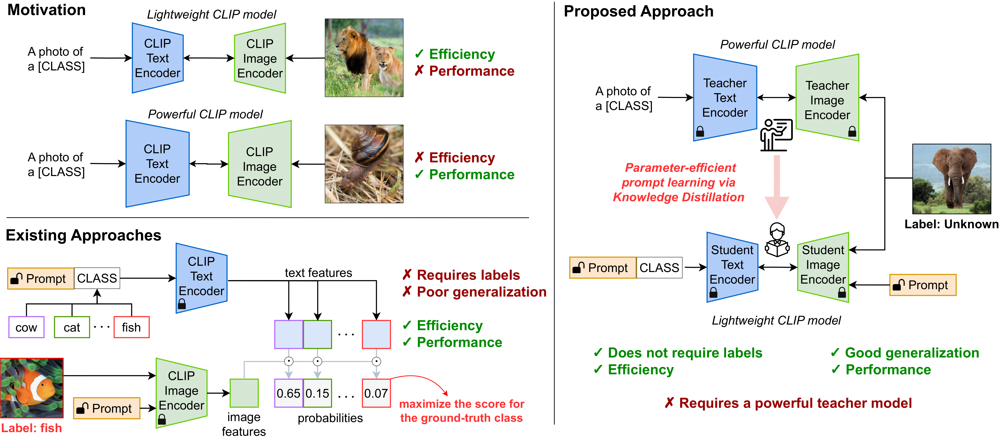

# KDPL (ECCV 2024)

### Improving Zero-shot Generalization of Learned Prompts via Unsupervised Knowledge Distillation

[](https://arxiv.org/abs/2407.03056)
[](https://eccv.ecva.net/virtual/2024/poster/823)
[](https://www.youtube.com/watch?v=AhHIOX900GY)
[](/assets/KDPL_slides.pdf)
[](/assets/ECCV_poster.pdf)
[](https://github.com/miccunifi/KDPL)

This is the **official repository** of the [**ECCV 2024 paper**](https://arxiv.org/abs/2407.03056) "*Improving Zero-shot Generalization of Learned Prompts via Unsupervised Knowledge Distillation*" by Marco Mistretta, Alberto Baldrati, Marco Bertini and Andrew David Bagdanov.

🔥🔥 **[2024/08/09] Our code is now public available! Feel free to explore, use, and contribute!** 🔥🔥

## Overview

### Abstract

Vision-Language Models (VLMs) demonstrate remarkable zero-shot generalization to unseen tasks, but fall short of the performance of supervised methods in generalizing to downstream tasks with limited data. Prompt learning is emerging as a parameter-efficient method for adapting VLMs, but state-of-the-art approaches require annotated samples. In this paper we propose a novel approach to prompt learning based on unsupervised knowledge distillation from more powerful models.  
Our approach, which we call Knowledge Distillation Prompt Learning (KDPL), can be integrated into existing prompt learning techniques and eliminates the need for labeled examples during adaptation. Our experiments on more than ten standard benchmark datasets demonstrate that KDPL is very effective at improving generalization of learned prompts for zero-shot domain generalization, zero-shot cross-dataset generalization, and zero-shot base-to-novel class generalization problems. KDPL requires no ground-truth labels for adaptation, and moreover we show that even in the absence of any knowledge of training class names it can be used to effectively transfer knowledge. 



**Top Left** Lightweight VLMs like CLIP achieve impressive zero-shot performance but lag behind supervised approaches; large VLMs incur a high computational burden. **Bottom left** Parameter-efficient prompt learning offers a non-destructive approach to adapting VLMs to downstream tasks; however, existing methods require annotated samples and struggle to generalize to unseen classes. **Right** Our approach does not require labeled samples and learns by distilling knowledge from a more powerful VLM. It can be seamlessly integrated into existing prompt learning techniques and generalizes better to unseen classes on downstream tasks.

## Citation
```bibtex
@article{mistretta2024improving,
  title={Improving Zero-shot Generalization of Learned Prompts via Unsupervised Knowledge Distillation},
  author={Mistretta, Marco and Baldrati, Alberto and Bertini, Marco and Bagdanov, Andrew D},
  journal={arXiv preprint arXiv:2407.03056},
  year={2024}
}
```

<details>
<summary><h2>KDPL Installation Guide</h2></summary> 

This guide provides step-by-step instructions on how to set up the KDPL environment and install all necessary dependencies. The codebase has been tested on **Ubuntu 20.04.2 LTS** with **Python 3.8**.

## 1. Setting Up Conda Environment

It is recommended to use a Conda environment for this setup.

1. **Create a Conda Environment**
    ```bash
    conda create -y -n kdpl python=3.8
    ```

2. **Activate the Environment**
    ```bash
    conda activate kdpl
    ```

## 2. Installing PyTorch and Dependencies

Ensure you have the correct version of PyTorch and torchvision. If you need a different CUDA version, please refer to the [official PyTorch website](https://pytorch.org/).

1. **Install PyTorch, torchvision, and torchaudio**
    ```bash
    conda install pytorch==2.1.0 torchvision==0.16.0 torchaudio==2.1.0 pytorch-cuda=12.1 -c pytorch -c nvidia
    ```

## 3. Cloning KDPL and Installing Requirements

Follow these steps to clone and install the [Dassl library](https://github.com/KaiyangZhou/Dassl.pytorch).

1. **Clone the KDPL Code Repository**
    ```bash
    git clone https://github.com/miccunifi/KDPL.git
    cd KDPL/
    ```
    
2. **Clone the Dassl Repository**
    ```bash
    git clone https://github.com/KaiyangZhou/Dassl.pytorch.git
    ```

3. **Install Dassl Dependencies**
    ```bash
    cd Dassl.pytorch/
    pip install -r requirements.txt
    ```

4. **Install Dassl Library**
    ```bash
    python setup.py develop
    ```

5. **Install KDPL Dependencies**
    ```bash
    cd ..
    pip install -r requirements.txt
    pip install setuptools==59.5.0
    ```
---

</details>

<details>
<summary><h2>Dataset Installation Guide</h2></summary> 

To set up the datasets for KDPL, we follow the standard preparation methods outlined by CoOp. For detailed instructions, refer to the [CoOp Dataset Preparation Guide](https://github.com/KaiyangZhou/CoOp/blob/main/DATASETS.md).

</details>

<details>
<summary><h2>Training and reproducing KDPL results</h2></summary> 

We provide bash scripts in the [scripts/](../scripts) directory for training and evaluating [KDPL](https://github.com/miccunifi/KDPL) and the corresponding baseline approaches. Ensure that you update the `DATA` variable with the dataset path in the scripts file and run the commands from the source directory `src/`.

Below, we provide training and evaluation instructions. Note that the same instructions apply for reproducing results for the baseline and the KDPL variants. However, when using KDPL variants, ensure you update the `CLASS_AGNOSTIC` variable to `True` or `False` in the scripts depending on whether you want to use the class-agnostic **KDPL-CA** or not.

## Domain Generalization and Cross-Dataset Transfer Settings

In the cross-dataset and domain generalization setting, we first train on 16-shots per class on ImageNet-1k for 3 seeds. Then, we evaluate the trained model directly on cross-datasets and out-of-distribution datasets. Below are the instructions to reproduce domain generalization and cross-datasets results.

### Training

First, we need to train the model. Suppose we want to train CoOp+KDPL; similarly, we can train all the KDPL variants and corresponding baselines. Run the command below to train CoOp+KDPL with 16-shots and **3 seeds** on ImageNet-1k:

```bash
# Train CoOp+KDPL 16-shots, 3 seeds on ImageNet-1k 
bash scripts/coop_kdpl/reproduce_cross_d_train.sh
```

### Evaluation

Now, use the evaluation script `scripts/coop_kdpl/reproduce_cross_d_test.sh` and run the command below to calculate the results for **3 seeds on all the domain generalization and cross-dataset datasets**:

```bash
# Evaluate CoOp+KDPL 16-shots, 3 seeds on Domain Generalization and Cross-Dataset Transfer settings
bash scripts/coop_kdpl/reproduce_cross_d_test.sh
```

Replace `coop_kdpl` with the corresponding baseline or KDPL variant you want to reproduce the results for:

- Use `coop_kdpl` for CoOp+KDPL, or `coop` for CoOp.
- Use `cocoop_kdpl` for CoCoOp+KDPL, or `cocoop` for CoCoOp.
- Use `vpt_kdpl` for VPT+KDPL, or `vpt` for VPT.
- Use `maple_kdpl` for MaPLe+KDPL, or `maple` for MaPLe.
- Use `promptsrc_kdpl` for PromptSRC+KDPL, or `promptsrc` for PromptSRC.

This script should evaluate and save log files in the `output/` directory.

## Generalization to Unseen Classes

In the Generalization to Unseen Classes setting, we first train with 16-shots on half of the classes for 3 seeds. Then, we evaluate the trained model directly on the unseen half of the classes on the test set of the same dataset.

### Training

We provide the instructions below to reproduce generalization to unseen results. Run the command below to train CoOp+KDPL with 16-shots and 3 seeds on each dataset:

```bash
# Train CoOp+KDPL 16-shots, 3 seeds, on half of the classes on each dataset 
bash scripts/coop_kdpl/reproduce_base2new_train.sh
```

### Evaluation

Now, use the evaluation script `scripts/coop_kdpl/reproduce_base2new_test.sh` and run the command below to calculate the results for **3 seeds on all generalization to unseen classes datasets**:

```bash
# Evaluate CoOp+KDPL 16-shots, 3 seeds on Generalization to Unseen Classes setting
bash scripts/coop_kdpl/reproduce_base2new_test.sh
```

Replace `coop_kdpl` with the corresponding baseline or KDPL variant you want to reproduce the results for:

- Use `coop_kdpl` for CoOp+KDPL, or `coop` for CoOp.
- Use `cocoop_kdpl` for CoCoOp+KDPL, or `cocoop` for CoCoOp.
- Use `vpt_kdpl` for VPT+KDPL, or `vpt` for VPT.
- Use `maple_kdpl` for MaPLe+KDPL, or `maple` for MaPLe.
- Use `promptsrc_kdpl` for PromptSRC+KDPL, or `promptsrc` for PromptSRC.

This script should evaluate and save log files in the `output/` directory.

## Averaging results over 3 seeds: 
Once the above trainings and evaluations are completed, the `output/` directory should have the following structure:

```
output
|–– base2new/
|   |–– test_new/
|   |   |–– oxford_pets/
|   |   |   |–– shots_16/
|   |   |   |   |–– CoOp_KDPL/
|   |   |   |   |   |–– vit_b32_ctxv1/
|   |   |   |   |   |   |–– seed1/
|   |   |   |   |   |   |–– seed2/
|   |   |   |   |   |   |–– seed3/
|   |   |-- other_datasets/ ...
|   |–– train_base/
|   |   |–– oxford_pets/
|   |   |   |–– shots_16/
|   |   |   |   |–– CoOp_KDPL/
|   |   |   |   |   |–– vit_b32_ctxv1/
|   |   |   |   |   |   |–– seed1/
|   |   |   |   |   |   |–– seed2/
|   |   |   |   |   |   |–– seed3/
|   |   |-- other_datasets/ ...
|–– cross_domain_and_datasets/
|   |–– test/
|   |   |–– oxford_pets/
|   |   |   |–– shots_16/
|   |   |   |   |–– CoOp_KDPL/
|   |   |   |   |   |–– vit_b32_ctxv1/
|   |   |   |   |   |   |–– seed1/
|   |   |   |   |   |   |–– seed2/
|   |   |   |   |   |   |–– seed3/
|   |   |-- other_datasets/ ...
|   |–– train_base/
|   |   |–– imagenet/
|   |   |   |–– shots_16/
|   |   |   |   |–– CoOp_KDPL/
|   |   |   |   |   |–– vit_b32_ctxv1/
|   |   |   |   |   |   |–– seed1/
|   |   |   |   |   |   |–– seed2/
|   |   |   |   |   |   |–– seed3/
```

Now use the script `parse_test_res.py` and run the commands below to calculate the averaged results:
```bash
# averaged results for novel classes
python output/base2new/test_new/imagenet/shots_16/CoOp_KDPL/vit_b32_ctxv1 --test-log
# averaged results for the cross-domain and cross-dataset 
python output/cross_domain_and_datasets/test/imagenet/shots_16/CoOp_KDPL/vit_b32_ctxv1 --test-log
```

The above steps can be repeated for other individual datasets.


This repository also supports using official [CoOp](https://github.com/KaiyangZhou/CoOp), [CoCoOp](https://github.com/KaiyangZhou/CoOp), [MaPLe](https://github.com/muzairkhattak/multimodal-prompt-learning) and [PromptSRC](https://github.com/muzairkhattak/PromptSRC) scripts, configs and models.
Please refer to the respective documentation if you prefer to use the original bash scripts.

</details>


## Authors
* [**Marco Mistretta**](https://scholar.google.com/citations?hl=it&user=KMIb4eAAAAAJ)**\***
* [**Alberto Baldrati**](https://scholar.google.com/citations?hl=en&user=I1jaZecAAAAJ)**\***
* [**Marco Bertini**](https://scholar.google.it/citations?user=SBm9ZpYAAAAJ&hl=it)
* [**Andrew David Bagdanov**](https://scholar.google.com/citations?user=_Fk4YUcAAAAJ&hl=en)

**\*** Equal contribution.

## Acknowledgements

Our code is based on [PromptSRC](https://github.com/muzairkhattak/PromptSRC), along with [Co-CoOp and CoOp](https://github.com/KaiyangZhou/CoOp) repository. We thank the authors for releasing their code. If you use our model and code, please consider citing these works as well.
